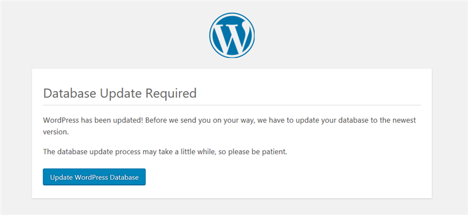
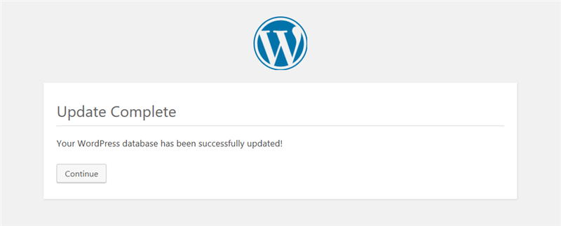
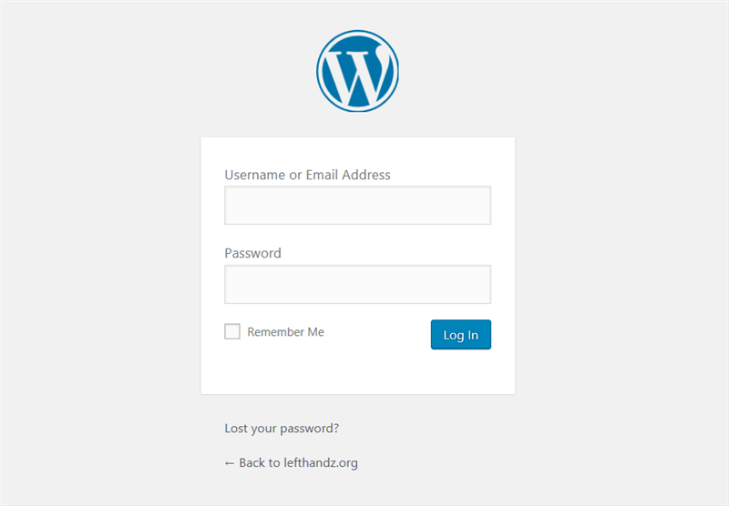

[WIP]

A sample to restore old WordPress with multi-containers on Azure Web App
====

Incidentally, if you added some changes to restored WordPress, the changes affect only in the container instances not be saved. So please recreate your container images, or save them in another way.

References
----
- [Create a multi-container (preview) app in Web App for Containers | Microsoft Docs](https://docs.microsoft.com/en-us/azure/app-service/containers/tutorial-multi-container-app)
- [Configure Web App to use the image from Azure Container Registry (or any private registry) - Use a custom Docker image for Web App for Containers - Azure | Microsoft Docs](https://docs.microsoft.com/en-us/azure/app-service/containers/tutorial-custom-docker-image#configure-web-app-to-use-the-image-from-azure-container-registry-or-any-private-registry)
- [Manual Plugin Installation - Managing Plugins « WordPress Codex](https://codex.wordpress.org/Managing_Plugins#Manual_Plugin_Installation)
- [library/mysql - Docker Hub](https://hub.docker.com/_/mysql/)
    - Initializing a fresh instance

Prerequisite
----

- Docker environment
    - [Docker - Build, Ship, and Run Any App, Anywhere](https://www.docker.com/)
- Docker compose
    - [Docker Compose | Docker Documentation](https://docs.docker.com/compose/)
- Azure Account
    - [Create your Azure free account today | Microsoft Azure](https://azure.microsoft.com/en-us/free/)
- Azure CLI
    - [Azure CLI 2.0 | Microsoft Docs](https://docs.microsoft.com/en-us/cli/azure/?view=azure-cli-latest)
    - In the step that you deploy to Azure Web App, you can use [Azure Cloud Shell](https://docs.microsoft.com/en-us/azure/cloud-shell/)

Roughly steps
----

1. Build containers
    - a wordpress container with plugins
    - a database container with initial data
2. Push these images to Azure Container Registry
3. Deploy them to Azure Web App

How it works
=====

Prepare this environment
----

Prepare the `.env` file and set values of below for your environment.

- `DB_PASSWORD`
- `DB_NAME`

And create container volume for running database container on your local machine.

```bash
# Prepare variables
cp .env.sample .env
sed -i -E 's/^(.*?DB_PASSWORD)=.*$/\1=<database password>/' .env
sed -i -E 's/^(.*?DB_NAME)=.*$/\1=<database name>/' .env

# Prepare a volume
docker volume create --name=azurewebapp-sample-multicontainers-db-data
```

Create an WordPress container that plugins pre-installed
----

Download plugin zip files to `./services/wordpress/plugins/` from [WordPress Plugins | WordPress.org](https://wordpress.org/plugins/) and unzip them. When build customized wordpress container image, these plugins are copied to default plugin directory `/usr/src/wordpress/wp-content/plugins/` in the container.

For example of plugin,
- [SyntaxHighlighter Evolved | WordPress.org](https://wordpress.org/plugins/syntaxhighlighter/)

```bash
# Put extracted plugins
unzip <your plugin zip file> -d ./services/wordpress/plugins/

# Build a customized wordpress container image
docker-compose -f docker-compose.local.yml build wordpress
```

Create a database(mysql) container that is initialized by data
----

Put your dump file (`.sql`) as `dump.sql` in `./services/mysql/`. When build customized mysql container image, the dump file is placed under `/docker-entrypoint-initdb.d` in the container, then the container use the file for initialization. If you want to use `.sh` or `.sql.gz` as dump file, update `./services/mysql/Dockerfile`. For detail, see _Initializing a fresh instance_ in [library/mysql - Docker Hub](https://hub.docker.com/_/mysql/).

```bash
# Put your dump file
cp <your dump file> ./services/mysql/dump.sql

# Build a customized mysql container image
docker-compose -f docker-compose.local.yml build mysql
```

If you want to setup the database with updated data, dump the updated data, put that and build again. 

```bash
source .env
docker exec -it custom-mysql mysqldump -hlocalhost --databases ${DB_NAME} -p${DB_PASSWORD} > dump_updated.sql
mv services/mysql/dump.sql services/mysql/dump.sql.backup
mv dump_updated.sql services/mysql/dump.sql
docker-compose -f docker-compose.local.yml build mysql
```


Check the containers
----

```bash
docker-compose.exe -f docker-compose.local.yml up -d
```

Open `http://localhost/wp-admin`. Then if the page is _white_ or something is wrong, some errors occurred. check your `siteurl` and `home` in `wp-options` table.


```bash
# Access to the database and change the siteurl and home url
source .env
docker exec -it custom-mysql mysql -hlocalhost -p${DB_PASSWORD} ${DB_NAME}

mysql> select * from wp_options where option_name = 'siteurl' or option_name = 'home';
+-----------+---------+-------------+----------------------------+----------+
| option_id | blog_id | option_name | option_value               | autoload |
+-----------+---------+-------------+----------------------------+----------+
|        37 |       0 | home        | http://<your previous url> | yes      |
|         1 |       0 | siteurl     | http://<your previous url> | yes      |
+-----------+---------+-------------+----------------------------+----------+
1 row in set (0.00 sec)

mysql> update wp_options set option_value = 'http://localhost' where option_name = 'siteurl';
Query OK, 1 row affected (0.01 sec)
Rows matched: 1  Changed: 1  Warnings: 0

mysql> update wp_options set option_value = 'http://localhost' where option_name = 'home';
Query OK, 1 row affected (0.02 sec)
Rows matched: 1  Changed: 1  Warnings: 0

mysql> select * from wp_options where option_name = 'siteurl' or option_name = 'home';
+-----------+---------+-------------+------------------+----------+
| option_id | blog_id | option_name | option_value     | autoload |
+-----------+---------+-------------+------------------+----------+
|        37 |       0 | home        | http://localhost | yes      |
|         1 |       0 | siteurl     | http://localhost | yes      |
+-----------+---------+-------------+------------------+----------+
2 rows in set (0.00 sec)
```

Then open `http://localhost/wp-admin`, you would see the page below if you need to update the database structure.

> Database Update Required
> 
> WordPress has been updated! Before we send you on your way, we have to update your database to the newest version.
The database update process may take a little while, so please be patient.

Press the _Update WordPress Database_ and _Continue_ buttons.




Let's log in to your WordPress. After activating the necessary plugins, check the your site `http://localhost`. Can you see correct your site? Congrats!




Push built container images to Azure Container Registry
----

After checking your new WordPress environment, push the images to Azure Container Registry. It's private and able to be used by Azure Web App. If you don't have Azure CLI in your local machine, please install that.

```bash
# Log in to Azure
az login

# Create a resource group
RESOURCE_GROUP=<your resource group name>
LOCATION=<location>
az group create --name ${RESOURCE_GROUP} --location ${LOCATION}

# Create an Azure Container Registry
ACR_NAME=<name of container registry>
ACR_SKU=<SKU of the container registry, ex) Basic>
az acr create --name ${ACR_NAME} --resource-group ${RESOURCE_GROUP} --sku ${ACR_SKU} --admin-enabled true

# Set registry
echo "export REGISTRY=${ACR_NAME}.azurecr.io" >> .env
source .env

# Tag images
docker tag custom-wordpress:local ${REGISTRY}/custom-wordpress
docker tag custom-mysql:local ${REGISTRY}/custom-mysql

# Login to the registry
az acr login --name ${ACR_NAME}

# Push images to the registry
docker push ${REGISTRY}/custom-wordpress
docker push ${REGISTRY}/custom-mysql
```

Deploy these containers to Azure Web App
----

```bash
# Create docker compose config file for Azure Web App
source .env
cat docker-compose.yml | envsubst > docker-compose.webapp.yml

# Create App Service plan for Azure Web App
APPSERVICE_NAME=<name of App Service plan>
APPSERVICE_SKU=<SKU of App Service plan, ex) B1>
az appservice plan create --name ${APPSERVICE_NAME} --resource-group ${RESOURCE_GROUP} --sku ${APPSERVICE_SKU} --is-linux

# Create Azure Web App with docker-compose configuration
WEBAPP_NAME=<name of Azure Web App>
az webapp create --resource-group ${RESOURCE_GROUP} --plan ${APPSERVICE_NAME} --name ${WEBAPP_NAME} --multicontainer-config-type compose --multicontainer-config-file docker-compose.webapp.yml

# If `jq` is installed, you can parse the credentials of Azure Container Registry like below
# Or set the `ACR_USERNAME` with `username` and `ACR_PASSWORD` with `passwords[0].value` manually.
ACR_CREDENTIALS=$(az acr credential show --name ${ACR_NAME})
ACR_USERNAME=$(echo ${ACR_CREDENTIALS} | jq -r '.username')
ACR_PASSWORD=$(echo ${ACR_CREDENTIALS} | jq -r '.passwords[0].value')

# Set the credential to the Web App
az webapp config container set --name ${WEBAPP_NAME} --resource-group ${RESOURCE_GROUP} --docker-registry-server-url https://${REGISTRY} --docker-registry-server-user ${ACR_USERNAME} --docker-registry-server-password ${ACR_PASSWORD}

# Restart the Web App
az webapp restart --name ${WEBAPP_NAME} --resource-group ${RESOURCE_GROUP}

# Show the hostname of the Web App
az webapp config hostname list --webapp-name ${WEBAPP_NAME} --resource-group ${RESOURCE_GROUP} --query [0].name --output tsv
```

Notes
====

```bash
# Delete container instances
docker-compose down
```